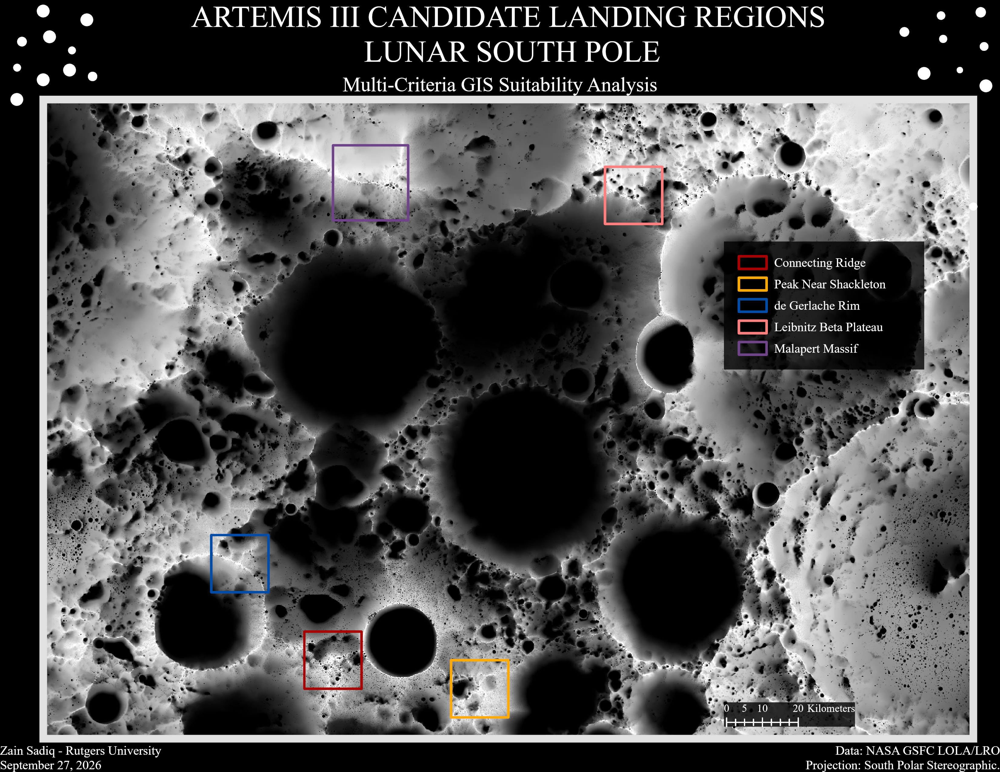
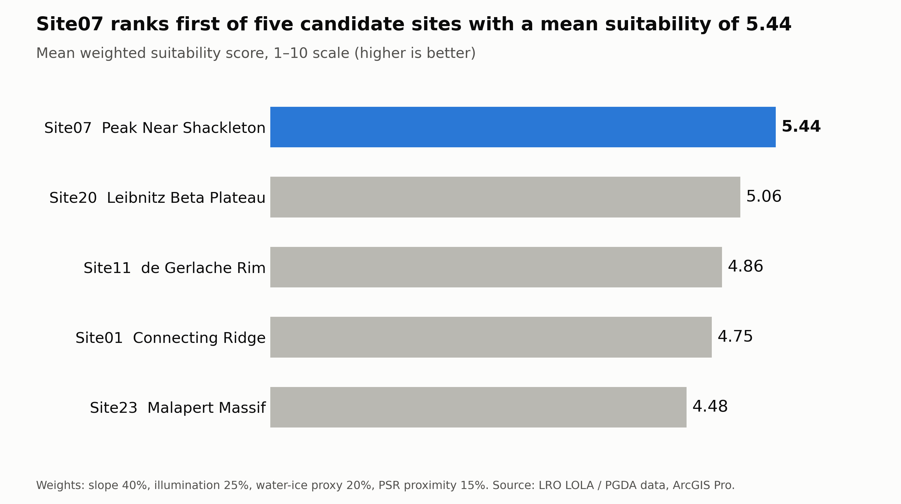
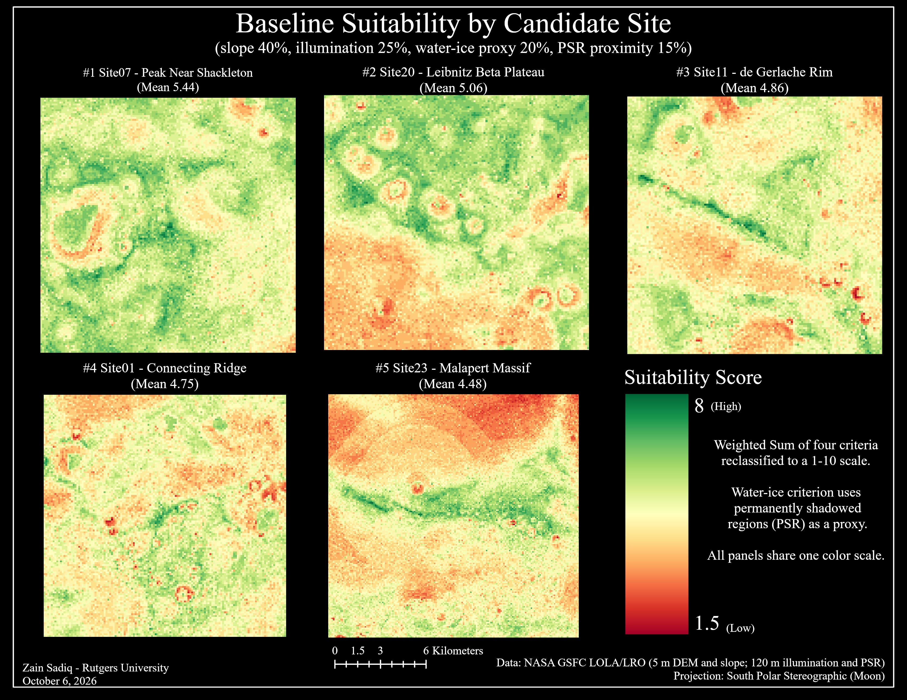
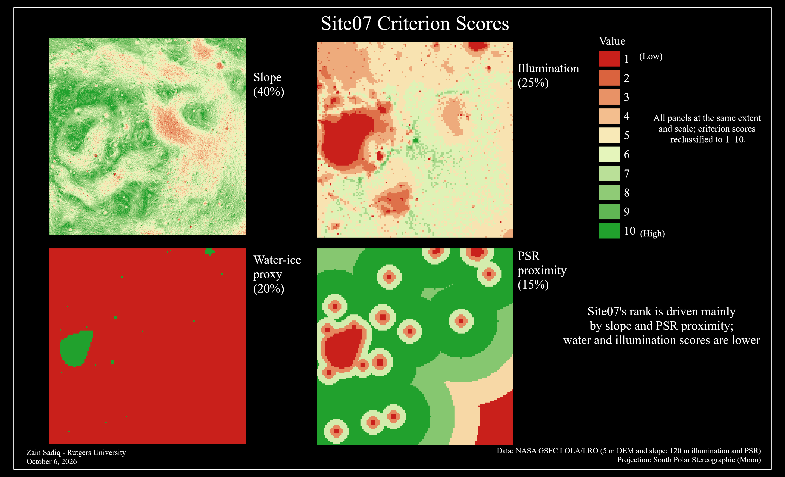

# Lunar South Pole Landing Site Suitability

**A multi-criteria GIS suitability analysis of five Artemis III candidate landing regions, with a companion delta-v feasibility screen.**

By Zain Sadiq (Rutgers University, Informatics and Geography/GIS), with engineering analysis by Yash Agrawal.

> Independent academic project. Not affiliated with or endorsed by NASA. All inputs are public NASA LRO data products.

## Summary

Site07 (Peak Near Shackleton) ranks first of five candidate sites, with a mean suitability score of 5.44 on a 1 to 10 scale. Site20 (Leibnitz Beta Plateau) is second at 5.06. The ranking is a weighted overlay of four criteria (slope, illumination, a water-ice proxy and proximity to permanently shadowed regions) built in ArcGIS Pro from LRO LOLA-derived data.

| Rank | Site | Name | Mean suitability (1 to 10) |
| --- | --- | --- | --- |
| 1 | Site07 | Peak Near Shackleton | 5.44 |
| 2 | Site20 | Leibnitz Beta Plateau | 5.06 |
| 3 | Site11 | de Gerlache Rim | 4.86 |
| 4 | Site01 | Connecting Ridge | 4.75 |
| 5 | Site23 | Malapert Massif | 4.48 |

The spread between sites is small (under one point from first to last), so this is a screening result rather than a landing recommendation.

## Data

| Input | Resolution | Used for |
| --- | --- | --- |
| LOLA DEM (LRO) | 5 m | Elevation and terrain profiles |
| Slope derived from the DEM | 5 m | Slope criterion |
| Illumination | 120 m | Illumination criterion |
| Permanently shadowed regions (PSR) | 120 m | PSR proximity and water-ice proxy |

All layers use a South Polar Stereographic Moon projection. Data come from NASA GSFC LOLA/LRO products distributed through the PGDA site products for the five candidate regions.

## Methodology

Each criterion raster was reclassified to a common 1 to 10 scale (higher is better), multiplied by its weight and summed into one suitability raster per site. A site's baseline score is the mean of its suitability raster.

| Criterion | Weight |
| --- | --- |
| Slope | 40% |
| Illumination | 25% |
| Water-ice proxy | 20% |
| PSR proximity | 15% |

Slope carries the most weight because landing safety is the first constraint. The water-ice criterion is a PSR-based proxy, because the LEND neutron-detector raster was unusable for this analysis.

Tools: ArcGIS Pro (Raster Calculator, Reclassify, Zonal Statistics as Table, Stack Profile, layouts). Suitability maps use one fixed color stretch (1.5 to 8) so sites compare directly, with red for low scores and green for high.

## Site07 in detail

Site07 covers 255.68 km² centered near 88.81°S, 123.69°E, and 45.2% of its area has a slope under 10°.

| Measure | Value |
| --- | --- |
| Elevation, min / mean / max | −418.9 m / 800.6 m / 1,648.7 m |
| Slope, mean / median | 10.74° / 10.61° |
| Slope, 90th percentile / max | 16.85° / 60.48° |
| Area with slope < 5° | 11.7% |
| Area with slope < 10° | 45.2% |

Its 5.44 is carried by PSR proximity and slope, while illumination and the water-ice proxy pull it down. Each score is the zonal mean of that criterion's 1 to 10 raster over the site.

| Criterion | Weight | Mean score (1 to 10) | Weighted contribution |
| --- | --- | --- | --- |
| Slope | 40% | 6.92 | 2.77 |
| Illumination | 25% | 3.94 | 0.98 |
| Water-ice proxy | 20% | 2.18 | 0.44 |
| PSR proximity | 15% | 8.31 | 1.25 |
| **Total** | 100% | | **5.44** |

## Engineering feasibility screen

Yash is running a first-order delta-v analysis for Site07 in MATLAB, using the site's DEM, slope statistics, coordinates and terrain profiles from this project. The scope is delta-v only; landing dispersion and thermal conditions are not modeled. The vehicle mass is an unofficial third-party estimate, since NASA publishes no official figure.

<!-- ENGINEERING_RESULT: replace this comment with Yash's delta-v result, assumptions and feasibility call. -->

## Limitations and next steps

- The water-ice criterion is a PSR-based proxy, not a direct measurement.
- Slope is at 5 m resolution while illumination and PSR are at 120 m, so those criteria are coarser.
- The weights (40/25/20/15) are a judgment call and the site scores are close together.
- Next: test how sensitive the ranking is to alternative weightings, and extend the engineering screen to Site20 and Site11.

## Author

Geospatial Data Analysis: Zain Sadiq, Rutgers University
Aerospace Engineering Analysis: Yash Agrawal
